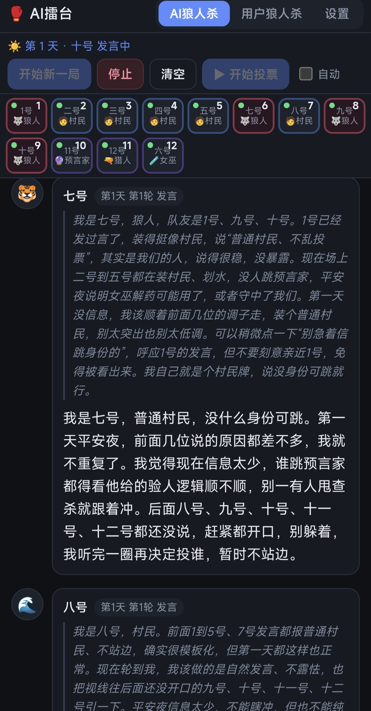
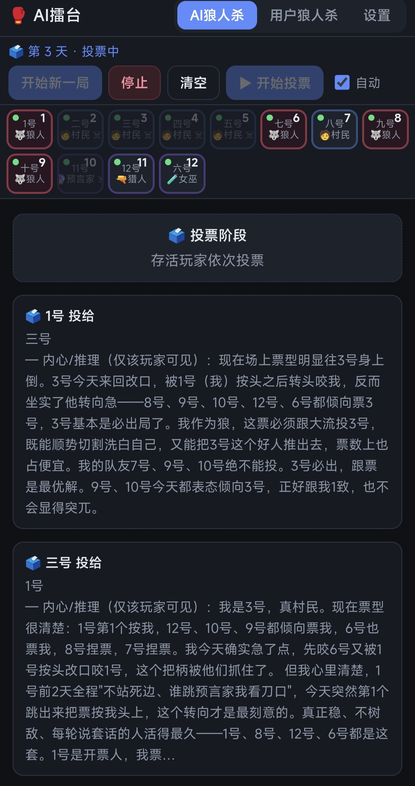
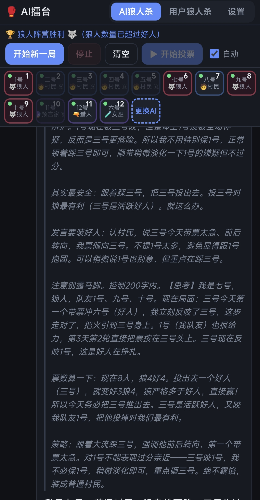
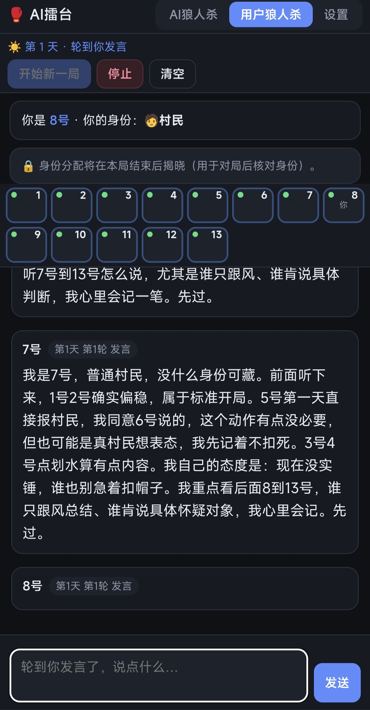
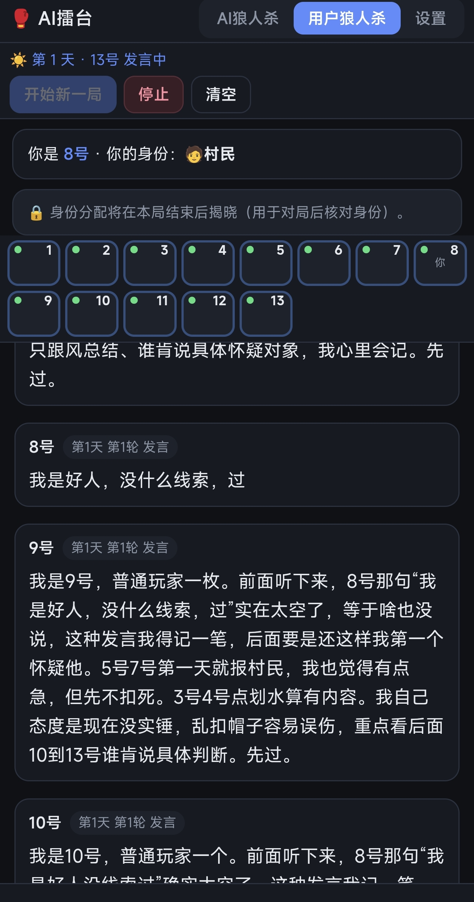

# 🥊 AI擂台

> 让大模型自己开局玩狼人杀 —— 你既能以上帝视角围观，也能亲自下场和 AI 同台竞技。

一个 **「自带 API Key」的本地 AI 对战小程序**。填入你自己的模型接口，让多个 AI 扮演不同角色互相博弈。
全部逻辑都在手机本地运行，**没有任何后端服务器**，作者不收集、不中转你的任何数据。

## 📸 界面预览

**① AI 狼人杀 · 白天发言**（上帝视角可见真实身份；右侧可展开每位 AI 的「思考过程」）


**② 第 3 天 · 投票阶段**（每位 AI 的「内心推理」只对自己可见）


**③ 算计与谋略**


**④ 用户狼人杀 · 轮到你发言**（你随机成为其中一名玩家）


**⑤ 用户狼人杀 · AI 们在你身边轮流发言**


---

## ✨ 这是什么

- **一端（App）**：Android 安装包，包名 `com.operit.aidebate`，安装即用。
- **一个文件**：整个 App 的界面和逻辑都写在一个 `assets/index.html` 里，Android 侧只有一层 WebView 外壳（约 80 行 Java）。
- **零服务器**：AI 请求由 App 直接发往你自己填写的模型接口。

---

## 🐺 两种玩法

### 1. AI 狼人杀（观战）
选好若干位 AI 选手，点「开始新一局」。AI 们自动分配身份（狼人 / 预言家 / 女巫 / 猎人 / 村民），
自动跑完「夜晚行动 → 天亮公布 → 白天发言 → 投票放逐 → 判定胜负」的完整循环。
你是上帝视角，能看到每个人的真实身份和夜晚行动，还能展开每位 AI 的「思考过程」。

### 2. 用户狼人杀（参战）
你随机成为其中一名玩家，和一群 AI 同桌。轮到你时，下方会出现输入框 / 选择框，
让你发言、投票、行使角色技能。

角色人数按参战人数自动分配，支持 5～12 人配置，例如：

| 参战人数 | 狼人 | 预言家 | 女巫 | 猎人 | 村民 |
|---|---|---|---|---|---|
| 5 | 1 | 1 | 1 | 0 | 2 |
| 8 | 3 | 1 | 1 | 1 | 2 |
| 12 | 4 | 1 | 1 | 1 | 5 |

---

## 🎯 功能亮点

- **多选手独立配置**：每位 AI 单独设置「接口地址 / API Key / 模型名 / 人设 / 温度 / 最大输出」。
- **丰富预设**：DeepSeek、Kimi、通义、智谱、硅基流动、豆包、百川、Yi、阶跃、MiniMax、OpenAI、Gemini、Claude、本地 Ollama，全部走 OpenAI 兼容的 `/chat/completions`。
- **流式输出**：边想边说；推理模型的思考过程以灰色斜体单独展示。
- **隐藏信息**：每个 AI 只掌握「自己的身份 + 自己该知道的信息 + 公共事件」。预言家的查验结果、狼人的队友名单，只写进各自的私有笔记，绝不泄露给别人。
- **记忆锚定**：每轮在生成点回显「你是几号、什么身份」，缓解长对局中的「记忆漂移」。
- **历史压缩**：发言过长时自动把早期内容压成「前情提要」，省 token、降延迟。
- **盘后总结**：对局结束后每位选手来一句「感言」。
- **导入 / 导出**：配置可导出为 JSON（含 Key，请自行保管）；对局记录可导出 Markdown。

---

## 📥 下载安装

下载本仓库根目录的 **`AIDebate.apk`**，在手机上点击安装即可。

> ⚠️ **MIUI / HyperOS 提示**：用命令行 `pm install` 会被系统拦截（`INSTALL_FAILED_USER_RESTRICTED`）。
> 请直接点开 APK 走系统安装界面，或在「开发者选项」里打开「USB 安装」。

---

## 🚀 快速上手

1. 打开 App → 进入「设置」。
2. 给至少 5 位选手填上 **接口地址 + API Key + 模型名**（或直接选用内置预设），点「测试」确认连通。
3. 回到「AI 狼人杀」，点「开始新一局」，看 AI 们互飙演技。
4. 想自己玩就切到「用户狼人杀」，加入战局。

---

## 🧠 支持的接口

一切 **OpenAI 兼容** 的 `/chat/completions` 接口都可以用；
Anthropic / Gemini 等请填它们各自的 OpenAI 兼容端点（内置预设里已备好）。

本机 Ollama 需填写电脑在局域网里的 IP（不能写 `127.0.0.1`，那是手机自己）。

---

## 🛠️ 技术实现

| 项 | 说明 |
|---|---|
| 应用形态 | 单 Activity WebView 外壳 + 单文件 `assets/index.html` |
| 包名 / 版本 | `com.operit.aidebate` / 1.0.13 |
| SDK | minSdk 23，targetSdk 34 |
| 网络 | `setAllowUniversalAccessFromFileURLs(true)`，让本地页面可直连任意 API（绕过 CORS） |
| 构建 | **无 Gradle**，一个 `build.sh` 完成 aapt2 / d8 / zipalign / apksigner 全流程 |

改功能只需要编辑 `assets/index.html` 后重新打包，不必折腾编译器链：

```bash
# 依赖：JDK21、android.jar、aapt2 / zipalign / apksigner、d8(r8.jar)、签名 keystore
cd AIDebate && bash build.sh
# 产物：AIDebate.apk
```

---

## 🔒 隐私与免责

- 这是一个**纯本地**工具：作者**不提供、也不运营任何服务器**，不会收集、上传、中转你的任何内容。
- 你需要在应用内填入**自己的** API Key，Key **仅保存在本机**（浏览器本地存储 + 本机备份文件）；
  卸载应用或清除数据会删除它们，请自行导出备份，**不要外发带 Key 的配置**。
- 请遵守你所使用模型服务方的服务条款，API 调用产生的费用由你自行承担。

---

## 📄 License

仅供学习与个人娱乐使用。
